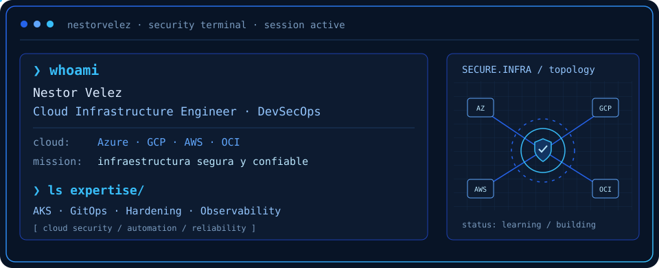
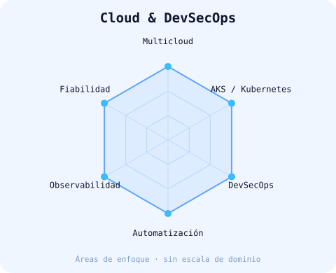
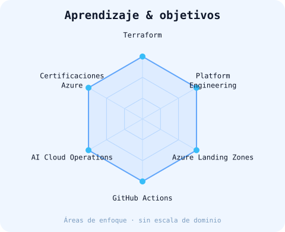

<!-- BLUE SECURITY TERMINAL BANNER -->
<picture>
    <source media="(prefers-color-scheme: dark)" srcset="assets/banner-dark.v10.svg">
    <source media="(prefers-color-scheme: light)" srcset="assets/banner-light.v10.svg">
    
  </picture>

 

---

## `$ whoami`

  

 

## `$ cat tech-stack.yaml`

<table border="1" cellpadding="14" bgcolor="#081426">
<thead><tr><th colspan="2" align="left"><code>nestorvelez:~$ cat tech-stack.yaml</code></th></tr></thead>
<tbody>
<tr>
<td width="50%" valign="top"><code>├─ ☁ cloud_infrastructure:</code>  
 
 
<code>Microsoft Azure · Google Cloud (GCP) · AWS · Oracle OCI</code> 
<code>Azure Landing Zones (aprendizaje)</code></td>
<td width="50%" valign="top"><code>├─ ☸ containers_platform:</code>  
 
<code>AKS · Kubernetes · Docker · Linux</code></td>
</tr>
<tr>
<td width="50%" valign="top"><code>├─ ⚙ delivery_gitops:</code>  
 
<code>Azure DevOps · GitHub Actions · ArgoCD · GitOps</code></td>
<td width="50%" valign="top"><code>├─ ◉ monitoring_observability:</code>  
 
<code>Dynatrace · Azure Monitor · Zabbix</code></td>
</tr>
<tr>
<td width="50%" valign="top"><code>├─ ⌁ automation_iac:</code>  
 
<code>Bash · PowerShell · Terraform (aprendizaje)</code></td>
<td width="50%" valign="top"><code>├─ ✦ security_devsecops:</code>  
 
<code>SonarQube · RBAC · Hardening · Parches · Vulnerabilidades</code></td>
</tr>
</tbody><tfoot><tr><td colspan="2"><code>focus: cloud_security · automation · reliability</code></td></tr></tfoot>
</table>

---

## `$ kubectl get signals --all-namespaces`

  <picture>
    <source media="(prefers-color-scheme: dark)" srcset="assets/radar-dark.svg">
    <source media="(prefers-color-scheme: light)" srcset="assets/radar-light.svg">
    
  </picture>&nbsp;
  <picture>
    <source media="(prefers-color-scheme: dark)" srcset="assets/radar-langs-dark.svg">
    <source media="(prefers-color-scheme: light)" srcset="assets/radar-langs-light.svg">
    
  </picture>

<code>signals: cloud_devsecops_focus · learning_map · sin puntuaciones de dominio</code>

---

## `$ connect --socials`

&nbsp;
&nbsp;

Hecho con 💻 y mucho café · @nestorvelez

